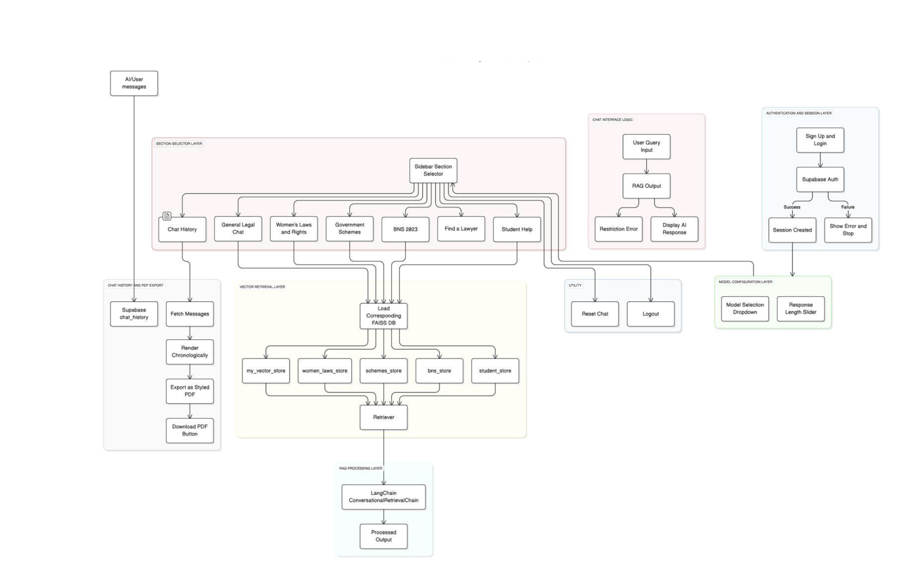
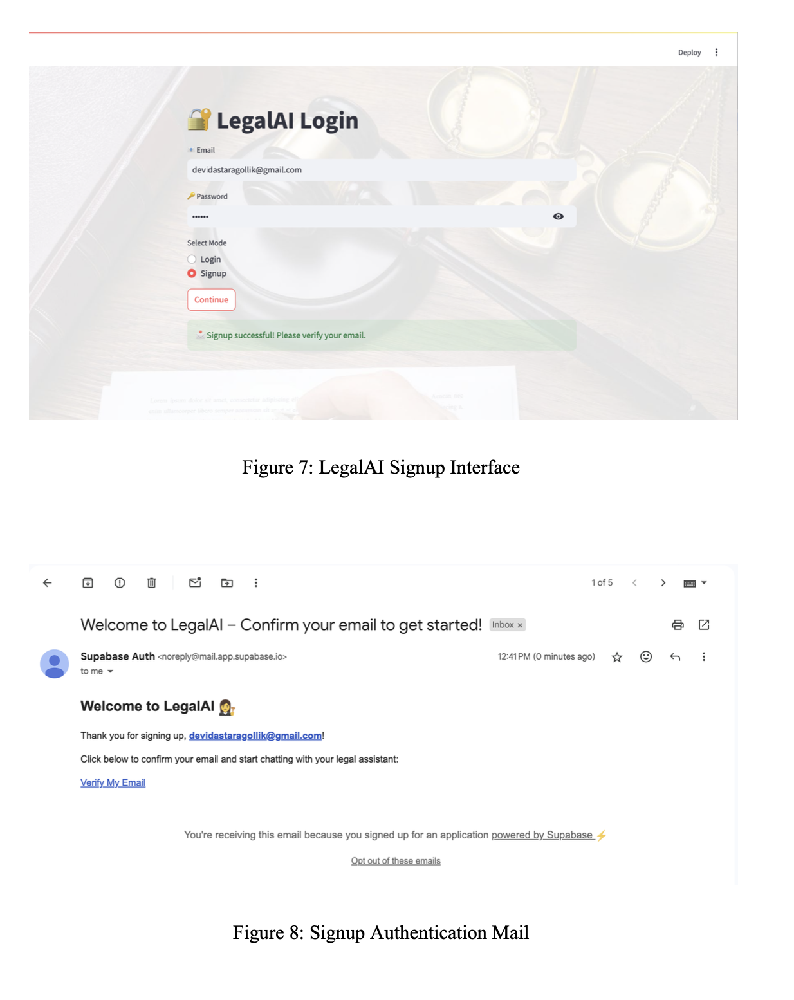
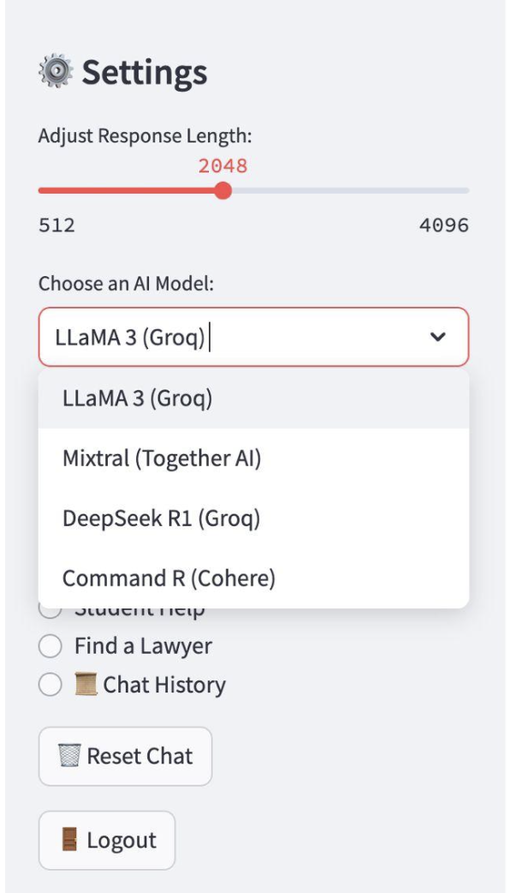
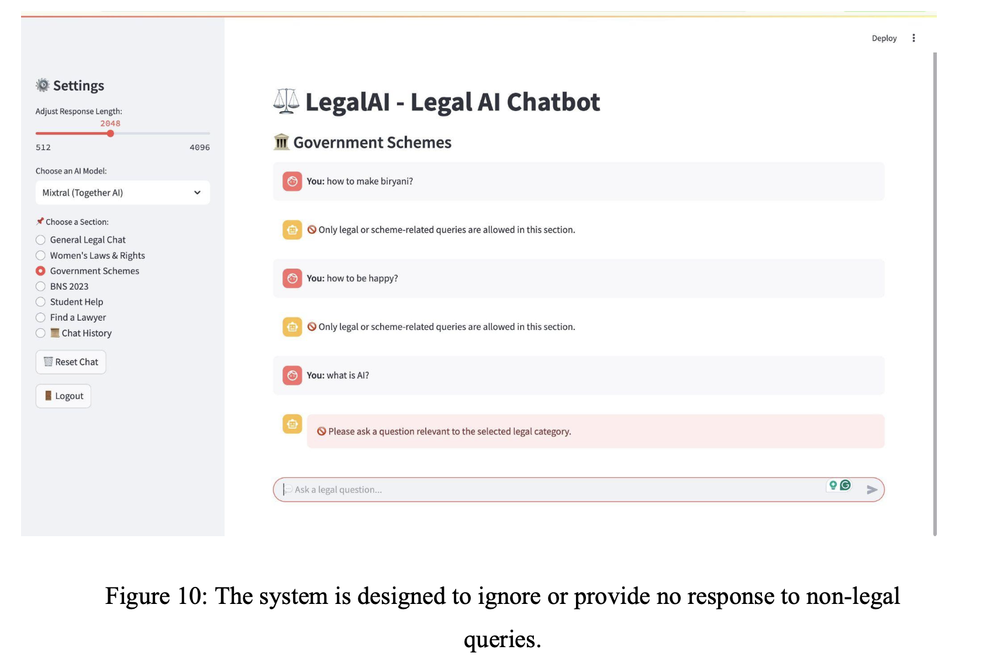
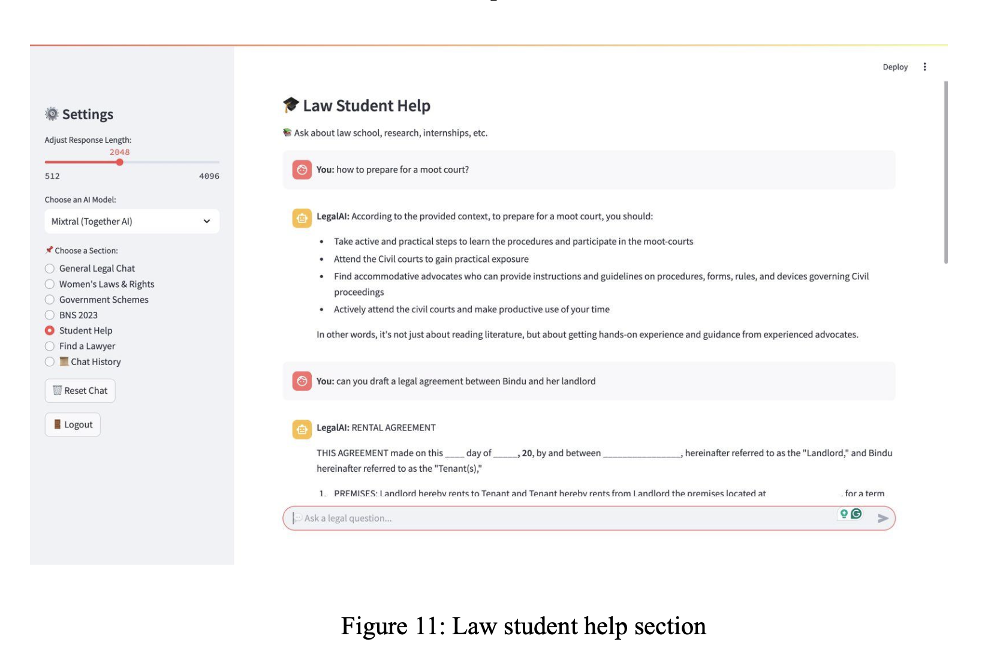
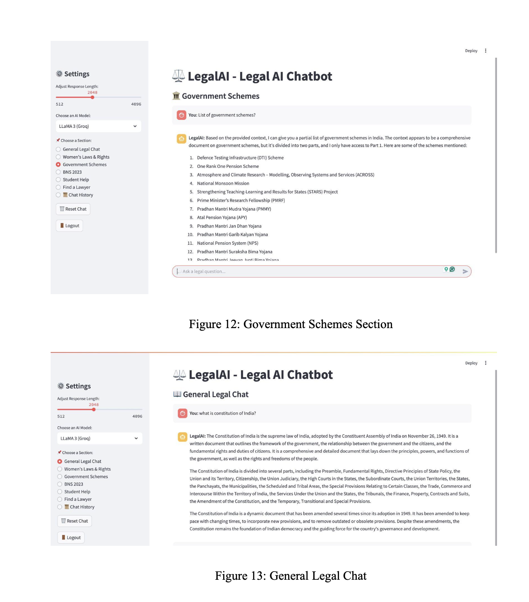
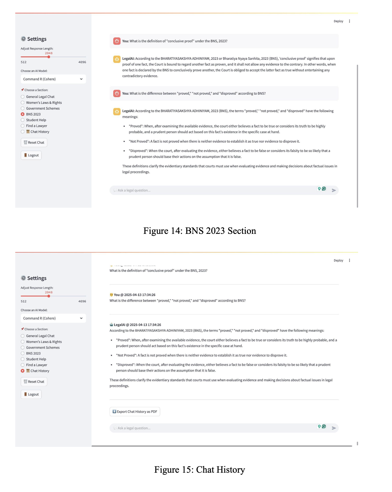
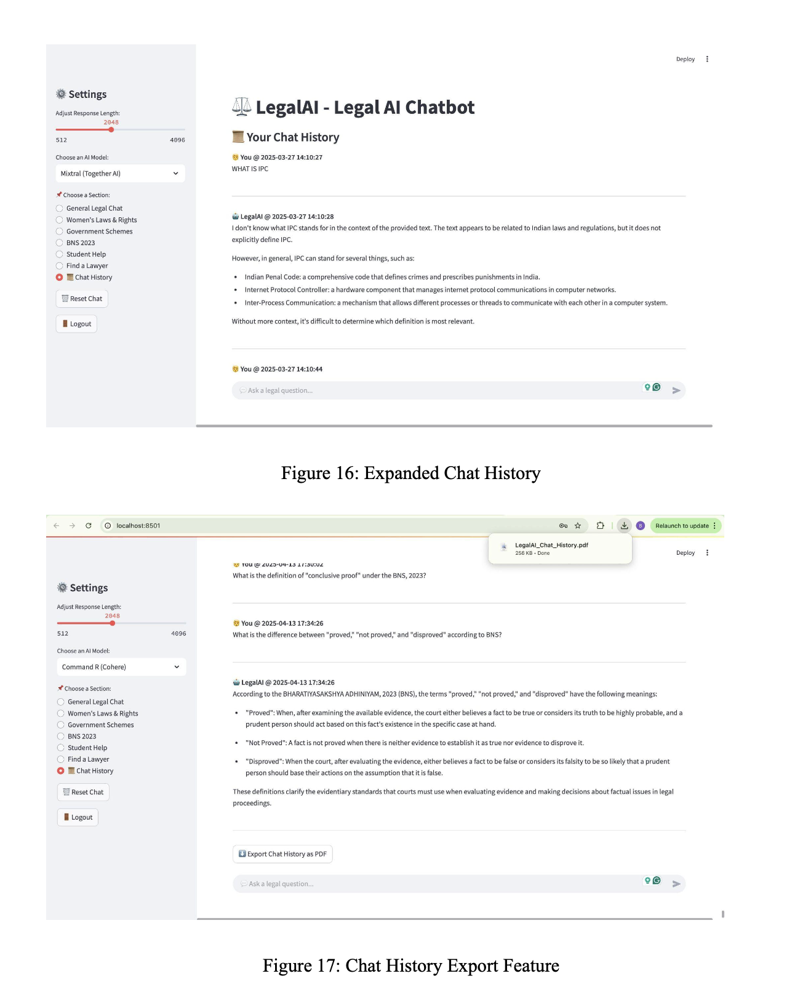
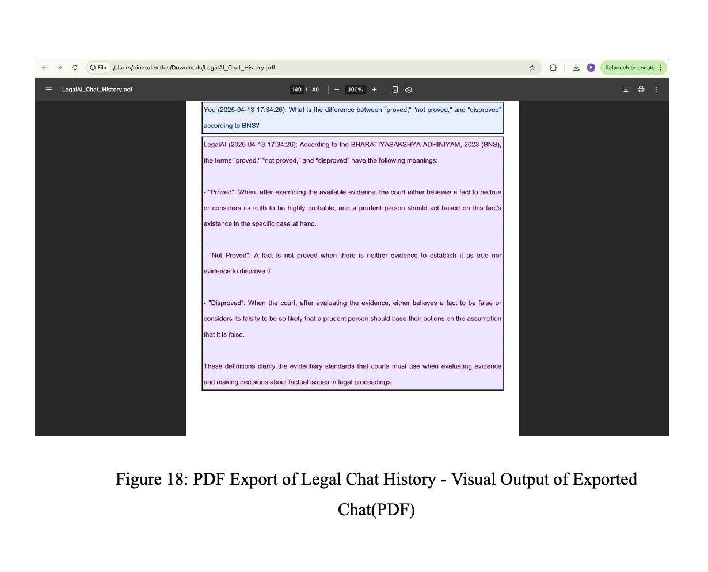

# ⚖️ LegalAI – AI-Powered Legal Chatbot

LegalAI is an intelligent legal assistant built using **LangChain**, **FAISS**, and **Streamlit**, designed to make legal knowledge accessible, structured, and interactive. Powered by cutting-edge **LLMs** such as LLaMA 3, Mixtral, DeepSeek R1, and Command R, LegalAI allows users to get domain-specific answers across topics like general law, women’s rights, government schemes, student legal help, and the Bharatiya Nyaya Sanhita (BNS) 2023.

---

## 🚀 Features

* 🔐 **User Authentication** via Supabase (Sign Up & Login)
* 🧠 **Retrieval-Augmented Generation (RAG)** using LangChain
* 🧾 **Domain-Specific Sections**: General Legal, Women's Laws, BNS 2023, Student Help, Schemes
* 💬 **LLM Switching**: Choose from LLaMA 3, Mixtral, DeepSeek R1, or Command R
* 📚 **FAISS-Based Vector Search** for accurate legal retrieval
* 📄 **Chat History Management & PDF Export** using FPDF
* 📊 **Real-Time Response Tuning**: Adjust response length interactively

---

## System Architecture

<p align="center">
  
</p>

---

## 🧑‍💻 Tech Stack

| Layer      | Technologies                         |
| ---------- | ------------------------------------ |
| UI         | Streamlit                            |
| Backend    | Python 3.10+, LangChain, FAISS       |
| Auth       | Supabase                             |
| Embeddings | Google Generative AI (embedding-001) |
| Vector DB  | FAISS (5 separate DBs per section)   |
| LLM APIs   | Groq, Cohere, Together AI            |
| Export     | FPDF for PDF chat export             |
| Deployment | Streamlit Cloud / Render (planned)   |

---

## 📂 Project Structure

```bash
LegalAI/
├── loginfinal.py          # Main Streamlit app
├── ingestionf.py          # Embeds PDFs into FAISS DBs
├── *.py                   # Individual section logic (e.g., govt_schemes.py)
├── Images/                # UI/architecture images
├── LEGAL-DATA/            # Source PDF data for ingestion
├── .env                   # API key configuration
├── requirements.txt       # Dependencies
├── Report-LegalAI.pdf     # Full report
````

---

## 🔐 Authentication

* Sign up using email/password via Supabase.
* Confirmation mail sent to the user.
* Session is securely stored and used to manage chat history.

<p align="center">
  
</p>

---

## 🔧 Environment Setup

```bash
# Create and activate virtual environment
python -m venv venv
source venv/bin/activate   # For Windows: venv\Scripts\activate

# Install dependencies
pip install -r requirements.txt
```

### 🔐 Configuration

Create a `.env` file in the root directory with:

```env
OPENAI_API_KEY=...
GROQ_API_KEY=...
TOGETHER_API_KEY=...
COHERE_API_KEY=...
SUPABASE_URL=...
SUPABASE_KEY=...
```

---

## 🧠 Ingesting Legal PDFs

To create vector databases for each legal section:

```bash
python ingestionf.py
```

This script will:

* Load all legal PDFs from `LEGAL-DATA/`
* Chunk text using LangChain
* Embed using Google Generative AI
* Store vectors in FAISS index files (per domain)

---

## Running the App

```bash
streamlit run loginfinal.py
```

Once launched, you’ll see:

* **Login/Signup Screen**
* **Sidebar** for section and model selection
* **Chat Interface** powered by Retrieval-Augmented Generation

---

## ⚙️ Sidebar Options

* Choose Legal Domain
* Switch AI Models
* Adjust Response Length
* Reset Chat / Logout

<p align="center">
  
</p>

---

## 🧑‍⚖️ Legal Domain Modules

| Section               | Description                                               |
| --------------------- | --------------------------------------------------------- |
| General Legal Chat    | Constitution, judiciary, civil rights                     |
| Women’s Laws & Rights | Dowry Act, Domestic Violence, Maternity laws              |
| Government Schemes    | PM Awas Yojana, Jan Dhan, etc.                            |
| BNS 2023              | Indian Penal Code reform: legal definitions and standards |
| Student Help          | Research, moot courts, internships, legal drafting        |
| Find a Lawyer         | (Planned future enhancement)                              |

---

## 📥 Sample Interface Screens

<table>
<tr>
<td><br><center><b>Query Restrictions</b></center></td>
<td><br><center><b>Law Student Help</b></center></td>
</tr>
<tr>
<td><br><center><b></b></center></td>
<td><br><center><b></b></center></td>
</tr>
<tr>
<td><br><center><b></b></center></td>
<td><br><center><b></b></center></td>
</tr>
</table>

---

## 🧾 Chat Export (PDF)

* All user queries and bot responses are saved.
* Export to a professional-looking PDF via `Export Chat History` button.

<p align="center">
  
</p>

---

## 📈 Results

| Metric             | Result                                               |
| ------------------ | ---------------------------------------------------- |
| Avg. Response Time | \~2.8 seconds                                        |
| Accuracy           | >90% for domain-specific queries                     |
| Best LLM           | **Command R (Cohere)** for clarity + legal reasoning |

---

## 📌 Future Enhancements

* 🌐 Multilingual Support (via translation APIs)
* 🎙️ Voice Query Input
* 🔄 Real-time Legal Data Sync (from govt portals)
* ⭐ Chat Rating System
* 📍 Lawyer Directory Integration

---

## 👩‍💻 Authors

* [Bindu T D](https://github.com/Bindhu-T-Devidas)
* [Sruthika Sivakumar](https://github.com/Sruttz)
* Tanisha Ibrahim
* Under the guidance of Prof. Manjul Krishna Gupta (RV University)*

---

## 📜 License

This project is part of the B.Tech (Hons) Capstone. For educational and non-commercial use.

---


